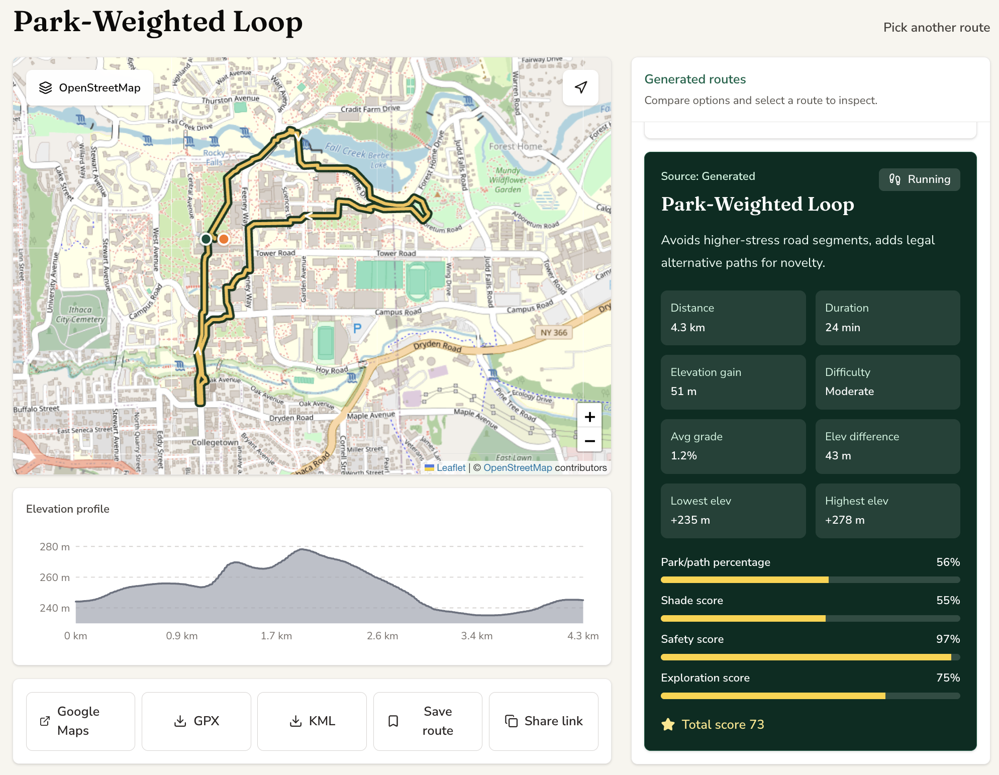
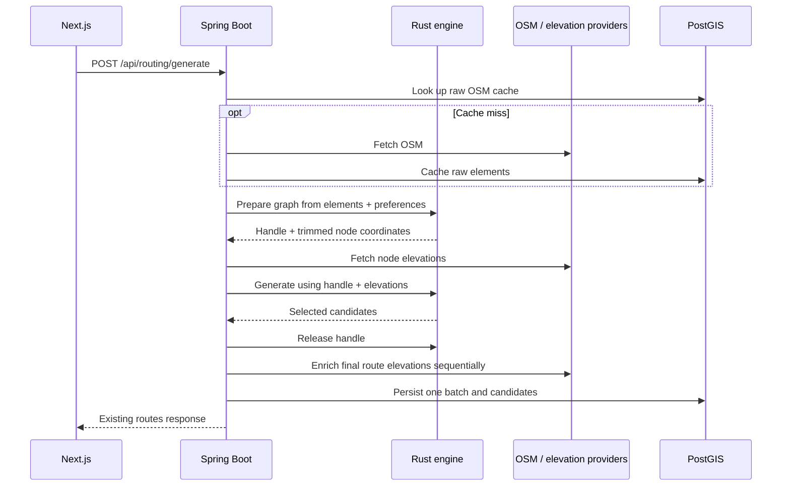

# RouteCraft

RouteCraft plans outdoor routes for running, hiking, and cycling. Generate a loop, an out-and-back route, or point-to-point alternatives; import a GPX/KML file; or start from Strava data. Review candidates on a map, compare their distance and elevation, and save a route.



## What improved

The complete CPU routing pipeline now runs in a private Rust service. Spring Boot retains the public API, external providers, raw OSM caches, elevation enrichment and PostGIS persistence. The frontend API contract is unchanged, and the Java engine remains available for rollback.

On the recorded 54-case matrix, Rust reduced the aggregate CPU-stage median by **71.9%**. Warm HTTP latency improved across every route type:

| Measure | Java | Rust | Change |
| --- | ---: | ---: | ---: |
| Loop warm p95 | 813.02 ms | 340.25 ms | −58.15% |
| Out-and-back warm p95 | 307.65 ms | 99.99 ms | −67.50% |
| Point-to-point warm p95 | 349.69 ms | 117.04 ms | −66.53% |
| Serial HTTP throughput | 4.29 requests/s | 10.80 requests/s | 2.52× |
| Combined peak RSS | 794.31 MiB | 845.42 MiB | +6.43% |

The matrix covers three recorded OSM areas, all three activities and route types, distance/duration targets, and two preference configurations. Each engine received 20 measured requests per fixture after warmup. Measurements ran on an Apple M5 Pro with 48 GiB RAM. HTTP measurements used real Spring/engine HTTP and PostGIS, with fixed OSM/elevation provider responses. Memory includes the Spring test JVM and Rust process; it excludes PostGIS and includes test-framework overhead. These are workstation measurements, not production concurrency results.

Rust became the default after compatibility and all measured adoption gates passed: at least 25% lower aggregate CPU-stage median, no route type's warm p95 regression above 5%, and combined memory growth at most 10%. [Full results, cold-request observations and limitations](services/routing-compat/BENCHMARKS.md) · [Machine-readable measurements](services/routing-compat/measurements-2026-09-06.json).

## Architecture

| Component | Stack | Responsibility |
| --- | --- | --- |
| Web app | Next.js 16, React 19, Tailwind v4, Zustand, Leaflet | Wizard, imports, map, results and saved routes |
| Public API | Spring Boot 4, Java 21 | Validation, OSM acquisition/cache, elevation providers, persistence, Strava and geocoding |
| Private engine | Rust, Axum, Tokio, Serde, R-tree | Graph construction, spatial lookup, pathfinding, analysis and candidate selection |
| Database | PostgreSQL 16, PostGIS 3.4 | Saved routes, generated batches/candidates, geometry and raw OSM cache |



The engine has no published port in default Compose. Handles expire after two minutes, retained graphs have a 512 MiB budget, and CPU concurrency is bounded by available processors. A configurable 30-second computation budget excludes Spring's provider calls.

On Rust transport, restart, overload or deadline failure, Spring attempts Java once using the OSM and node elevations already acquired. Domain errors retain their existing public behavior. An engine outage does not directly select synthetic routes; the existing OSM-acquisition fallback remains. See the [migration guide](services/routing-compat/README.md) for protocol details, resource limits and failure tests.

## Run locally

Start the database, API and Rust engine from the repository root:

```bash
docker compose up --build
```

Start the frontend in another terminal:

```bash
cd apps/web
cp .env.example .env.local
pnpm install --frozen-lockfile
pnpm dev
```

Open [localhost:3000](http://localhost:3000). The public API listens on [localhost:18080](http://localhost:18080); PostgreSQL uses port 5432 and the development credentials in Compose. Flyway applies the database migrations on startup.

To select Java explicitly, recreate the API with:

```bash
ROUTECRAFT_ROUTING_ENGINE=java docker compose up -d routecraft-api
```

For native Java development, start only PostGIS with `docker compose up -d postgres`, then run `ROUTECRAFT_ROUTING_ENGINE=java ./mvnw spring-boot:run` from `services/routecraft-api`. For native Rust, run `cargo run --release --bin routecraft-engine` from `services/routecraft-engine`, then start Spring with `ROUTECRAFT_ENGINE_URL=http://localhost:8090 ./mvnw spring-boot:run` from the API directory.

Strava is optional. Export `STRAVA_CLIENT_ID`, `STRAVA_CLIENT_SECRET`, `STRAVA_ACCESS_TOKEN` and `STRAVA_REFRESH_TOKEN` to enable live segment loading; without them, that flow uses local mock data. Backend configuration is documented in [services/routecraft-api/.env.example](services/routecraft-api/.env.example). The frontend only needs its public API URL configuration.

This is a local-first demo. The backend has no authentication or per-user authorization; add those controls before exposing it publicly.

## Repository layout

```text
apps/web/                    Next.js frontend; run pnpm here
services/routecraft-api/      Spring API and Java reference engine; run ./mvnw here
services/routecraft-engine/   Rust library and private HTTP service; run cargo here
services/routing-compat/      Recorded fixtures, differential tests and benchmarks
docker-compose.yml           Local service stack
.github/workflows/           Java, Rust and Docker integration CI
```

There is no root package.json or package-manager workspace.

The user flow is `/` → `/route-source` → `/strava`, `/wizard` or `/upload` → `/results` → `/saved`.

## Routing behavior

Both engines preserve the existing access rules, scoring weights, search budgets, snapping, rounding, route names and explanations. The Rust implementation uses dense graph indices, contiguous adjacency, shared geometry and reusable search arrays. Green-feature scoring uses an R-tree broad phase followed by exact distance calculations, preserving containment, nearest-five selection, source-order ties and the 300 m cutoff.

- **Loops:** tiered waypoints, reusable first legs and closing corridors, cumulative edge penalties, despiking and self-overlap checks.
- **Out-and-back:** one preference-weighted shortest-path tree, followed by outbound reconstruction and exact retracing.
- **Point-to-point:** bounded edge-penalized A* alternatives and target-distance detours.
- **Selection:** distance filtering, preference-aware scoring and geometric diversity, with the existing relaxed thresholds and a maximum of three candidates.

Scoring accounts for distance, elevation, parks, shade, safety, scenery, exploration, activity, route style and time of day. Spring preserves node-elevation deduplication, the 800-point cap, partial-provider behavior and sequential final route enrichment.

## Persistence

| Table | Stored data |
| --- | --- |
| `saved_routes` | Saved route payloads and PostGIS LineString geometry |
| `generated_route_batches` | Preferences, route count and indexed candidate-derived bounding box |
| `generated_route_candidates` | Candidate metadata, payload JSON and SRID 4326 geometry |
| `osm_graph_cache` | Raw Overpass elements keyed by bounding box, with expiry |

Each successful generation persists one batch and its candidates in a transaction.

## Verification

Run commands from the named runtime directory:

```bash
# services/routecraft-api
./mvnw clean test

# services/routecraft-engine
cargo fmt --check
cargo clippy --locked --all-targets -- -D warnings
cargo test --locked --release

# apps/web
pnpm lint
pnpm build
```

The migration passed 27 Java tests, seven Rust unit tests and the 54-case Rust differential test. The recorded matrix checks graph attributes, candidate IDs and paths, field presence, enums, explanations and exact published rounding, using a 1e-6 tolerance for internal floating-point values. Real Docker integration covers the full matrix, restart and Java rollback; the frontend API-client smoke verifies one persisted batch and valid PostGIS geometry. CI runs these backend and integration checks on pushes and pull requests.

Use the [verification instructions](services/routing-compat/README.md#verification) to create the separate integration database and run the Docker/API-client checks. See [benchmark reproduction](services/routing-compat/README.md#performance-and-adoption) for the CPU and HTTP/memory harnesses. OpenStreetMap fixtures include source queries, capture metadata and [attribution](https://www.openstreetmap.org/copyright).
